# Configurar entorno en Eclipse (back-end)
Vamos a configurar el entorno de desarrollo en Eclipse paso a paso:

## 1) Abrir editor
Primero debemos localizar la carpeta donde tengamos clonado el repositorio `https://github.com/albgomceb/Drafter`. Esa misma carpeta la usaremos de _workspace_:

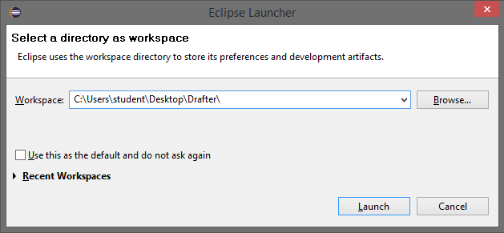

## 2) Crear proyecto
Dentro de este _workspace_ tendremos el proyecto back-end, pero necesitamos configurar Eclipse para poder trabajar con él. Primero creamos un proyecto genérico de Eclipse, en `File > New > Project...`. En la ventana emergente seleccionamos `General > Project`:

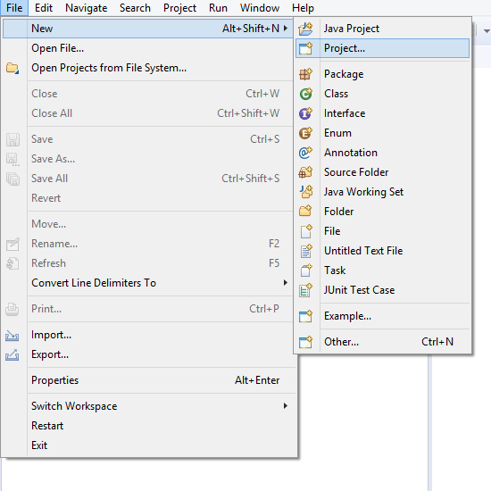

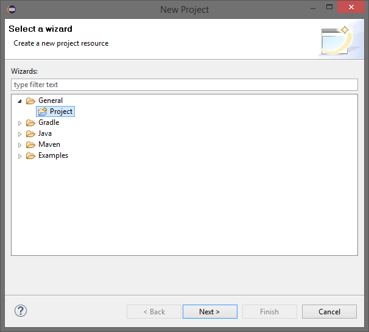

En la siguiente ventana, en el campo `Project name` ponemos el nombre **back-end**. Ya que este es el nombre de la carpeta que contiene el back-end de nuestro proyecto. Este nombre tiene que estar tal cual, sino creará un proyecto nuevo y nosotros solo queremos importar el ya existente:

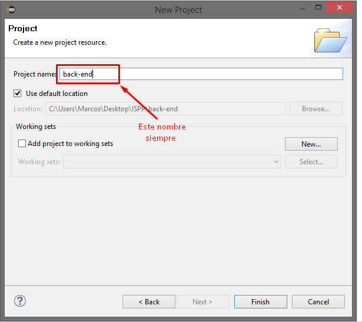

Una vez hecho esto, aparecerá un nuevo proyecto en el explorador de proyectos. Localizalo, haz click derecho y selecciona la opción `Configure > Convert to Maven Project`:

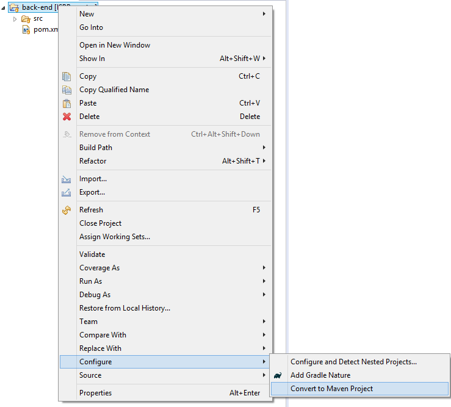

Y por último metete en la carpeta del proyecto en el explorador de archivos de tu sistema y borra la carpeta `bin` que crea Eclipse por defecto:

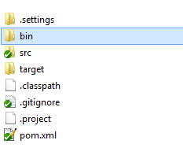

## 3) Configurar ejecuciones
Una vez tengamos el proyecto importado dentro de Eclipse, vamos a ejecutarlo, haber si todo ha ido bien. Pero para ello, tenemos que configurar lo que en Eclipse se llaman `Runs`. Esto se debe a que el proyecto está parametrizado mediante variables de entorno (resumen [aquí](configurar-app)). Asi que, cada vez que ejecutemos nuestro proyecto, esta variables deben de estar configuradas correctamente.

Primero, vamos a crear un _Run_ para que ejecute nuestro proyecto. En los iconos de arriba debe aparecer lo siguiente:

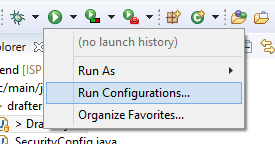

Pulsamos en `Run Configurations...` como aparece en la imagen. Una vez dentro seleccionamos la opción `Java Application` y pulsamos el icono de `nuevo` como aparece en la imagen:

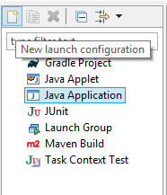

Para configurar este _Run_ vamos a darle un nombre, que en este caso será _Run MySQL_ porque en el ejemplo vamos a configurar el proyecto para que se conecte a una base de datos MySQL. Y no olvides asignarle el _entry point_ (aquí llamado _Main class_) con **drafter.Drafter**:

Una vez hecho esto, desplazte a la pestaña `Environmennt` y ahí, con el botón `New` ve estableciendo las variables de entorno correspondientes:

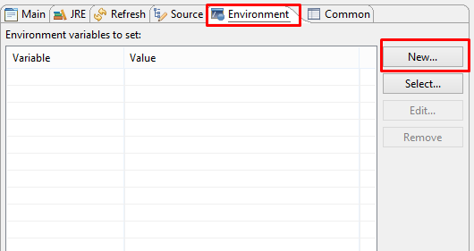

Que para nuestro ejemplo, quedaría así:

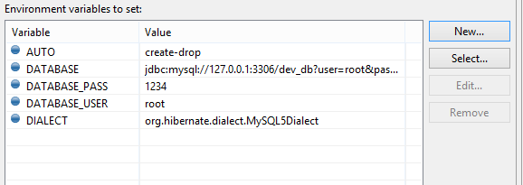

> **Nota:** Repita este paso para cualquier configuración de base de datos que desee tener.

Ahora con pulsar el botón `Run` de Ecilpse, o con la conbinación de teclas `Ctrl+F11`, ya puede ejecutarsa su proyecto. Si tiene la base de datos correspondiente abierta, todo debería ir bien.

## Configurar construcción del proyecto
Si desea trabajar en el front-end, en vez de tener un Eclipse abierto con el proyecto ejecutandose, se recomienda construir el `jar` del proyecto y ejecutar este. De esta forma ahorras tener un programa tan pesado como Eclipse abierto.

Para ello, vamos a seguir los mismos paso que en el punto anterior, pero en vez de crear un `Run` de Java ahora lo haremos de la opción `Maven Build`. Una vez creada la configuramos de la siguiente manera:

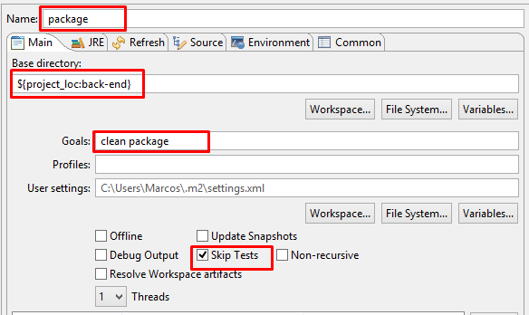

El nombre es totalmente optativo, no influye en nada uno u otro, en mi caso le puse _package_ que para mi es el mas descriptivo. En al campo `Goals` hay que poner `clean package` y no puede olvidarse marcar la casilla `Skip Tests` para que no ejecute los test de JUnit.

Ahora vamos a configutar las variables de entorno, que aunque son optatativos sus valores (solo cambiarán el nombre del `.jar` resultante) hay que definirlas. Por favor, ponga los valores recomendados, ya que harán falta después:

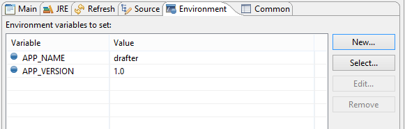

Una vez lo tengamos configurado, pulsamos el botón `Apply` y después `Run`. Si todo va bien, maven construirá nuestro `.jar` en la carpeta `target` de nuestro proyecto (para verlo acceda mediante el explorador de archivos de su sistema).

Por último, para ejecutar su proyecto vaya a la carpeta del repositorio `Utilidades/Runs scripts` y aquí encontrará unos ficheros que ejecutarán su proyecto (solo en Windows), cada uno con una base de datos distinta (recuerde que dicha base de datos debe de estar abierta).

> **Nota:** Si utilizaste una configuración distinta de las variables de entorno para construir tu `.jar` habrá cambiado su nombre, y por tanto será inaccesible para estos scripts.

## Otras ejecuciones
En el caso que querramos hacer otras ejecuciones, como por ejemplo, ejecutar los test de **JUnit** debemos seguir los pasos del punto 3, pero en vez de una ejecución de Java, una de JUnit. Las variables de entorno, han de ser las mismas. En caso de que se quiera depurar, se utiliraría el mismo `Run` que para ejecutar.